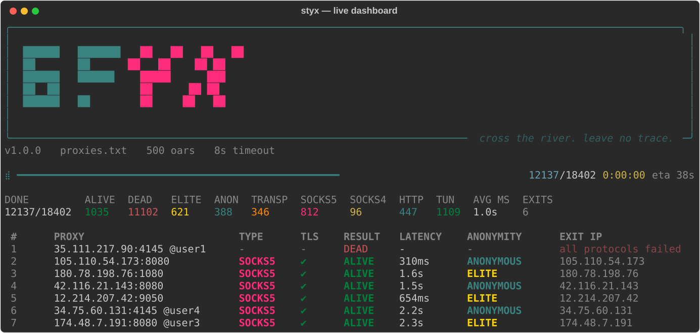
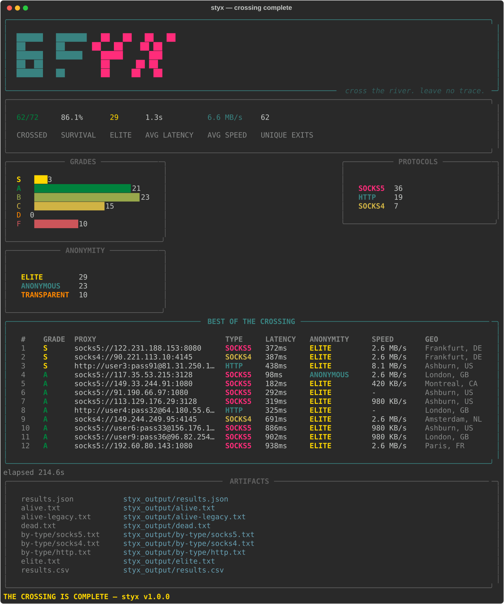

<div align="center">

```
██████   ███████   ██   ██   ██   ██
██       ██        ██   ██    ██ ██
██████   ██████      █████      ███
     ██  ██           ██      ██ ██
██████   ██           ██     ██   ██
```

# STYX — The Proxy Intelligence Framework

**Cross the river. Leave no trace.**

[](https://www.python.org)
[](LICENSE)
[](https://github.com/0xKuraishY/Styx)
[](https://github.com/0xKuraishY/Styx)

</div>

In Greek mythology, the River Styx separated the world of the living from the dead.
Charon ferried those who could pay across its dark waters — and never asked their names.

**Styx does the same for your traffic.** Throw a messy proxy list at it: 10,000 lines of
mixed `host:port`, `user:pass@host:port`, `socks5://` URLs, junk, duplicates. Styx parses
all of it, probes every entry, **auto-detects the wire protocol** (SOCKS5 / SOCKS4 / HTTP),
measures latency, tests TLS tunnelling, grades anonymity, geolocates exit IPs, benchmarks
throughput — and presents the whole crossing on a live terminal dashboard.

No list handy? `styx demo` raises four local proxy spirits and crosses them for you.



## Features

- **Universal parser** — understands every proxy-list dialect: `host:port`, `host:port:user:pass`,
  `user:pass@host:port`, `host:port@user:pass`, `scheme://[auth@]host:port`, IPv6 `[::1]:1080`.
  Junk lines and duplicates are counted, never fatal.
- **Protocol race detection** — for each proxy, SOCKS5 / SOCKS4 / HTTP attempts run concurrently
  against rotating judges; the first protocol to answer wins. A failed TCP probe short-circuits
  the race, so dead proxies cost milliseconds, not seconds.
- **Anonymity grading** — ELITE / ANONYMOUS / TRANSPARENT via header-echo judges: detects
  `X-Forwarded-For`, `Via`, `Client-IP` and friends, and compares the exit IP against your own.
- **Bring your own judge** — public echo services live behind CDNs that strip or inject headers.
  `styx judge` serves a clean IP/header echo endpoint for court-grade grading.
- **TLS tunnelling check** — verifies each proxy can `CONNECT` to HTTPS judges (reported per proxy).
- **Speed benchmarking** — real throughput measurement (KB/s → MB/s) per alive proxy.
- **GeoIP & ASN intelligence** — country, city, ISP, ASN, hosting/residential/mobile type, and
  whether the exit IP is already flagged in public proxy databases (ip-api.com batch API).
- **S/A/B/C/D/F grading** — a weighted score blending anonymity, latency, TLS capability
  and throughput, so the best proxies float to the top of every export.
- **Live Rich dashboard** — progress, ETA, protocol counters, anonymity counters and a scrolling
  result feed, all rendered in the terminal. `--quiet` for CI pipelines.
- **Full artifact set** — `results.json`, `results.csv`, `alive.txt`, `alive-legacy.txt`,
  `elite.txt`, `dead.txt`, and per-protocol files under `by-type/` (ready to feed tools).
- **`recheck`** — reload a `results.json`, retest only the dead (or alive) ones, merge, re-export.
- **Resumable state** — results are persisted with timestamps; `styx report` re-renders
  the full summary of any past crossing.
- **Demo mode** — `styx demo` spawns an authenticated SOCKS5 server and three HTTP forward
  proxies (elite / anonymous / transparent personalities) locally, then runs the full
  pipeline against them. Zero setup, works offline for the anonymity stages.



## Installation

```bash
git clone https://github.com/0xKuraishY/Styx.git
cd Styx
python3 -m venv .venv && source .venv/bin/activate
pip install -r requirements.txt
```

or install it properly:

```bash
pip install .
styx --help          # console entry point
```

Only three dependencies: `aiohttp`, `aiohttp-socks`, `rich`. Python ≥ 3.9.

## Quick start

```bash
# 10-second demo, no proxy list needed
python styx.py demo --geo --speed

# the real thing
python styx.py check proxies.txt --geo --speed -w 500 -t 8

# retest only the failures from last time, in place
python styx.py recheck styx_output/results.json --only dead

# re-render the summary of a past run
python styx.py report styx_output/results.json
```

## Usage

```
styx check <file> [options]
styx recheck <results.json> [--only dead|alive] [options]
styx report <results.json> [--top N]
styx demo [options]
styx judge [--host H] [--port P]
```

| Flag | Description |
|---|---|
| `-w, --workers` | concurrent checks (default: 250) |
| `-t, --timeout` | per-request timeout in seconds (default: 8) |
| `--tcp-timeout` | TCP probe timeout (default: 4) |
| `--scheme` | force `socks5` / `socks4` / `http` / `https` / `auto` (default: auto) |
| `--judge URL` | custom IP-echo judge (replaces the public pool) |
| `--header-judge URL` | custom header-echo judge → full elite/anonymous/transparent taxonomy |
| `--geo` | GeoIP/ASN enrichment of exit IPs (ip-api.com) |
| `--speed` | download benchmark per alive proxy |
| `--speed-size KiB` | benchmark payload size (default: 1024) |
| `--no-anonymity` | skip the anonymity judge (faster) |
| `-q, --quiet` | no live dashboard, final summary only |
| `-o, --output` | output directory (default: `styx_output`) |

## How detection works

1. **TCP probe** — `host:port` is opened directly. No answer → `dead` in ~4 s, no further work.
2. **Protocol race** — for survivors, SOCKS5, SOCKS4 and HTTP attempts are launched
   concurrently; each tries to reach an IP-echo judge through the proxy. The first success
   defines the detected protocol and the round-trip latency. Losers are cancelled.
3. **Anonymity judge** — a header-echo service is fetched through the proxy. If the judge
   sees your real IP (via `X-Forwarded-For`-style headers or an unchanged exit IP), the proxy
   is **transparent**. If it only sees proxy-identifying headers (`Via`, `Proxy-Connection`),
   it is **anonymous**. If it sees nothing at all, it is **elite**.
4. **TLS check** — an HTTPS judge is fetched through the proxy to confirm `CONNECT` tunnelling.
5. **Optional extras** — GeoIP batch lookup of unique exit IPs; streamed download benchmark.

> **A note on public judges.** Shared echo services (httpbin, httpbingo, …) sit behind CDN
> infrastructure that strips or injects `Via` / `X-Forwarded-For` on its own. With public
> judges, Styx therefore reports ELITE / TRANSPARENT (real-IP leak) / UNKNOWN conservatively.
> For the full three-level taxonomy, serve your own judge:
>
> ```bash
> styx judge                    # listens on 127.0.0.1:8388
> styx check list.txt --judge http://YOUR_HOST:8388/ip --header-judge http://YOUR_HOST:8388/echo
> ```

## Output files

| File | Contents |
|---|---|
| `results.json` | everything: per-proxy status, protocol, latency, exit IP, anonymity, TLS, speed, geo, grade, timestamps |
| `results.csv` | the same, flat, for spreadsheets |
| `alive.txt` | best first — canonical `scheme://[auth@]host:port` lines |
| `alive-legacy.txt` | `host:port:user:pass` dialect |
| `elite.txt` | elite-anonymity shortlist |
| `dead.txt` | the fallen, original lines |
| `by-type/socks5.txt` / `socks4.txt` / `http.txt` | alive proxies split per detected protocol |

## Grading

| Grade | Meaning |
|---|---|
| **S** | elite + ≤ 400 ms + TLS + ≥ 1.5 MB/s |
| **A** | elite, or anonymous and fast |
| **B** | anonymous |
| **C** | slow or partially leaky |
| **D** | transparent / crawling |
| **F** | dead |

## Programmatic use

Styx is a framework, not just a CLI:

```python
import asyncio
from styx.engine import Engine, EngineOptions, fetch_real_ip
from styx.parser import parse_lines

proxies = parse_lines(open("proxies.txt").read().splitlines()).proxies
opts = EngineOptions(workers=500, timeout=8, speed_test=True)
engine = Engine(opts, real_ip=asyncio.run(fetch_real_ip()))
results = asyncio.run(engine.run(proxies))

for r in results:
    if r.alive:
        print(r.detected_scheme, r.proxy.endpoint, r.anonymity.value, r.grade)
```

## The pantheon

Styx is one vessel in a fleet of mythological security tools:

**Styx** · [Argus](https://github.com/0xKuraishY) · [VulnAegis](https://github.com/0xKuraishY) · [Titan](https://github.com/0xKuraishY) · [Nidhogg](https://github.com/0xKuraishY) · [Citadel](https://github.com/0xKuraishY)

## Roadmap

- Proxy chains (proxy → proxy → judge) and per-country latency maps
- HTML interactive report (like the gods intended)
- Sticky-session rotation detection (repeated probes per session ID)
- SOCKS5 over TLS and HTTP/2 CONNECT probe support

## Legal

Only test proxies you own or are explicitly authorized to test. The authors are not
responsible for misuse of this tool. See [LICENSE](LICENSE).

## Credits

Created by **[0xKuraishY](https://github.com/0xKuraishY)**.
GeoIP data by [ip-api.com](https://ip-api.com) (non-commercial use).
